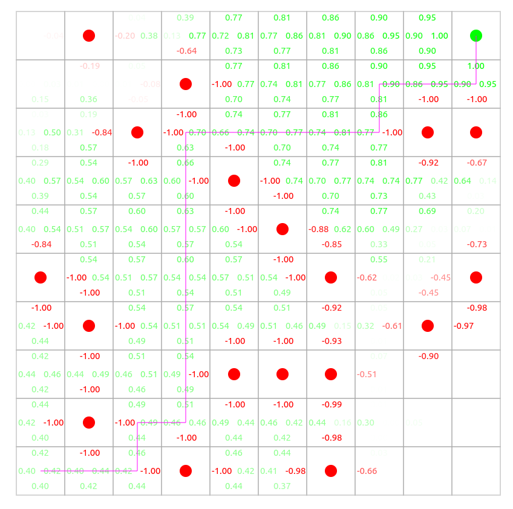

# Reinforcement-Learning

A repository where I store various project around reinforcement learning

## List of projects :
- [x] Classic Q-Learning in a 2D grid environnement
- [ ] Snake Deep Q-Learning
- [ ] Tic-Tac-Toe Q-Learning
- [ ] Minesweeper Deep Q-Learning
- [ ] Flappy-Bird Q-Learning

## Projects links & overview

### Classic Q-Learning in a 2D grid environnement
[Try live demo](https://sylvainsenechal.github.io/Reinforcement-Learning/GridEnvironnement/index.html)   

### Snake Deep Q-Learning
### Tic-Tac-Toe Q-Learning
### Minesweeper Deep Q-Learning
### Flappy-Bird Q-Learning

